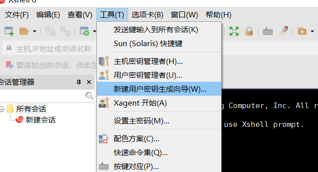
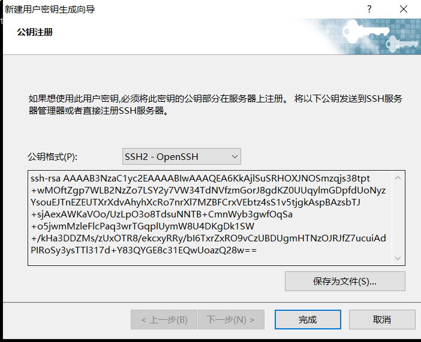
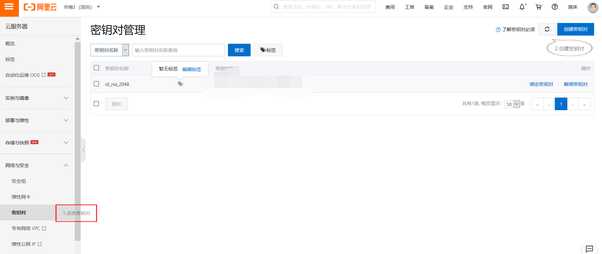
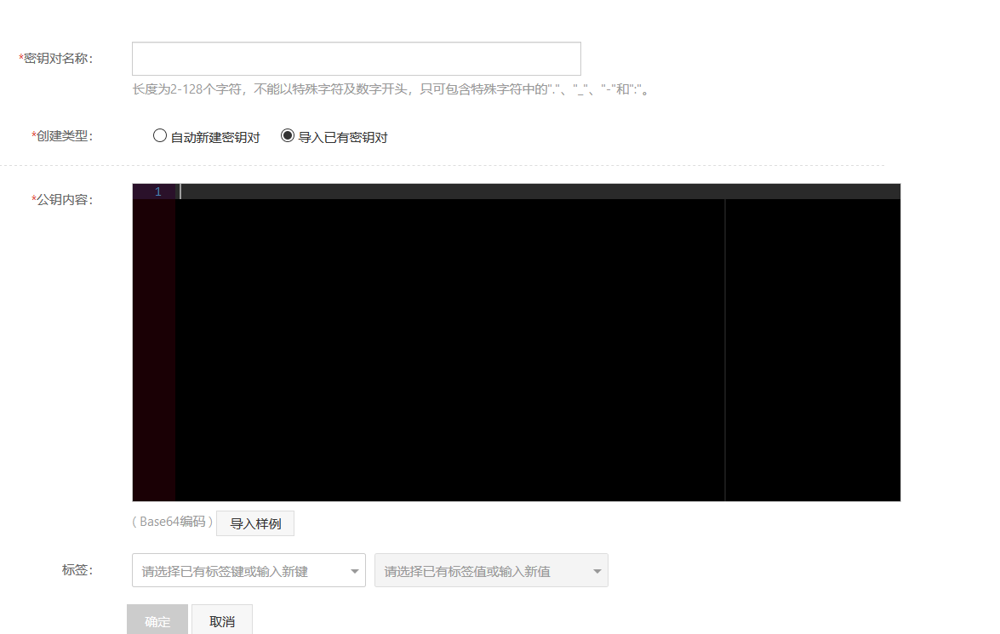
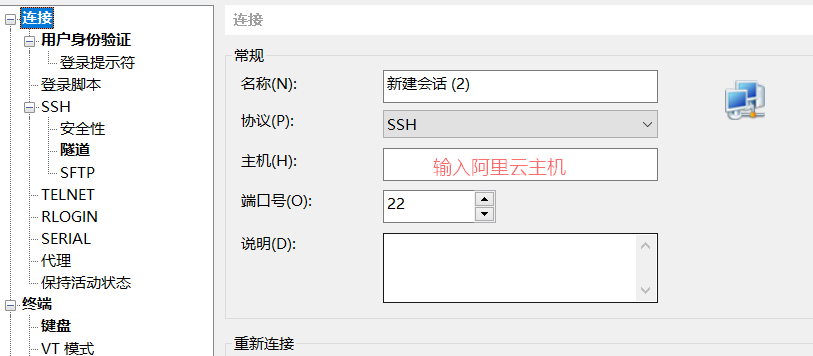
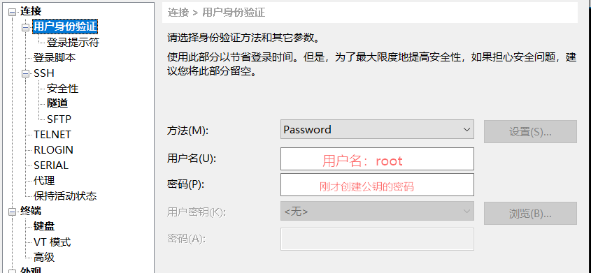

# 搭建云服务器（一）

## 一、购买服务器

1. 购买服务器，比如：[阿里云的服务器](https://www.aliyun.com/minisite/goods?userCode=venx3eke&share_source=copy_link)
2. 购买后，可以登录阿里云的控制台的**提货券管理**找到刚才买的服务器；
3. 系统选择：就近地区的服务器----Centos---最新版本系统；

## 二、连接服务器

> 一般通过SSH连接去操作服务器；
>
> 对于连接阿里云服务器，一般可以通过阿里云服务器控制台的远程连接进入服务器，也可以在电脑上打开dos命令窗口使用ssh root@外网IP，之后输入远程密码登录。
>
> 也可以使用Xshell去连接服务器。

使用Xshell连接服务器步骤：

1. 生成公钥

   

2. 得到公钥的信息,复制并保存文件

   

3. 在阿里云后台创建密钥对(将复制的公钥粘贴上去)

   

   

4. 重启服务器

   

5. Xshell登录

   

   

