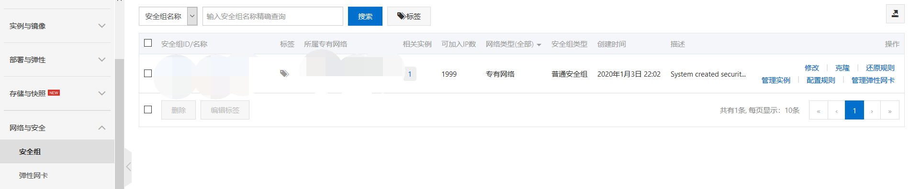
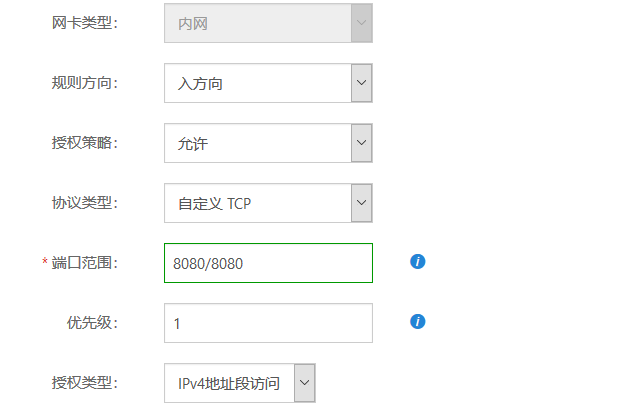
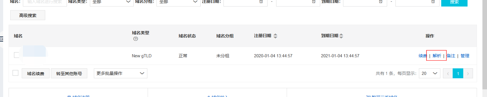
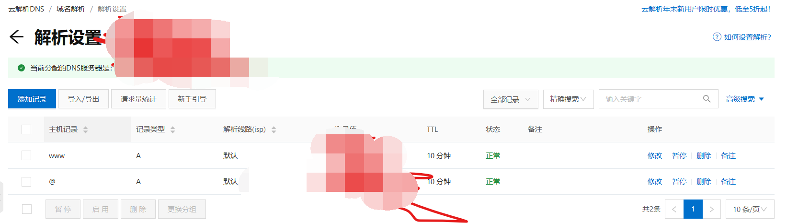
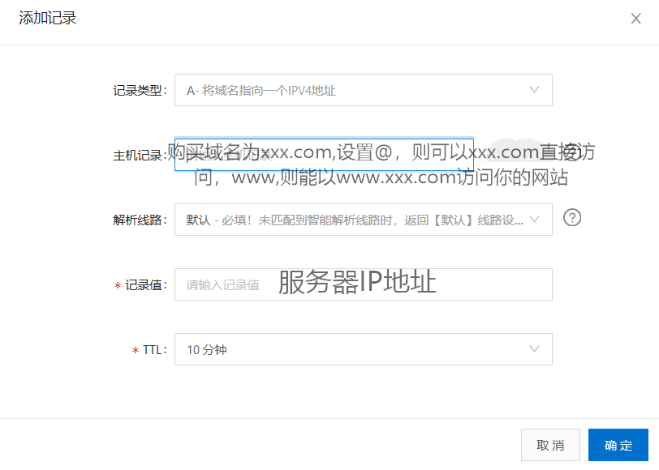

# 搭建云服务器（三）

## 一、配置安全组，暴露8080端口

在“网络与安全”下的“安全组”选项卡，点击“配置规则”，如下图：

选择“添加安全组规则”，修改规则方向“入方向”，端口范围为”8080/8080“，这样就能访问8080接口了，如下图：

## 二、购买域名，绑定域名

“产品与服务”-->“域名”-->选择你购买的域名-->“点击解析”-->点击“添加记录”;

记录添加后还需备案才能正常访问你的网站，否则会报错。

## 三、备案

域名需要进行备案才能进行正常访问；