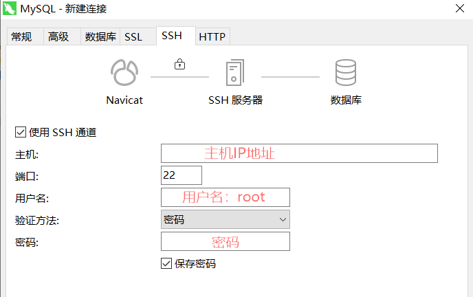
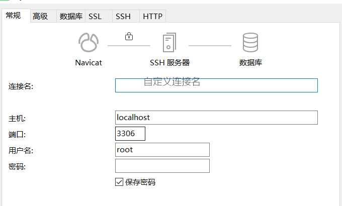

# 服务器搭建（二）

> 我们需要配置服务器运行环境，所以需要装一个jdk，一个mysql数据库，一个tomcat，之后才进入项目，安装方式有很多种，这里用了yum命令；
>
> 在连接服务器后，以命令行的方式进行如下操作；

## 一、JDK安装

1. 安装路径：yum命令安装后jdk路径在`/user/lib/jvm`

2. 查看CentOS自带JDK是否已安装：`yum list installed|grep java`

3. 如果存在自带的jdk，删除CentOS自带的JDK

   ```java
   yum -y remove java-1.7.0-openjdk*
   yum -y remove tzdata-java.noarch
   //结果显示为Complete！表示卸载完成！
   ```

4. 查看yum库下的Java安装包:`yum -y list java*`   (查看版本号)

5. 安装java:`yum -y install java-1.8.0-openjdk*`

6. 安装完后输入`java -version`查看是否安装完成，和安装的jdk版本；

## 二、mysql安装

1. 安装路径：yum命令安装之后路径`/var/lib/mysql/`

2. 下载MySQL的repo源：

   `wget http://repo.mysql.com/mysql-community-release-el7-5.noarch.rpm`

3. 安装`mysql-community-release-el7-5.noarch.rpm`包

   `sudo rpm -ivh mysql-community-release-el7-5.noarch.rpm`，安装这个包后，会获得两个mysql的`yum repo`源：

   ```java
   /etc/yum.repos.d/mysql-community.repo
   /etc/yum.repos.d/mysql-community-source.repo
   ```

4. 安装mysql : `sudo yum install mysql-server`

   - 根据提示安装，不过安装完成后没有密码，需要重置密码；

5. 重置mysql密码：

   - `mysql -uroot`:登录时有可能报这样的错：ERROR 2002 (HY000): Can‘t connect to local MySQL server through socket ‘/var/lib/mysql/mysql.sock‘
   - 原因是`/var/lib/mysql`的访问权限问题：通过`sudo chown -R root:root /var/lib/mysql`把`/var/lib/mysql`的拥有者改为当前用户;
   - 然后重启mysql服务：`service mysqld restart`
   - 接下来登录重置密码：
   - `mysql -u root`
   - mysql命令模式：
   - `use mysql;`
   - `update user set password=password('1234') where user="root";`
   - `exit;`

6. 可以使用Navicat远程连接数据库：

   

   

## 三、安装tomcat服务器

1. 安装路径：yum命令安装后路径`/usr/share/tomcat`
2. 检查系统是否存在Tomcat服务器：`systemctl status tomcat.service`
   - `systemctl status XXX`：查看指定服务的状态
3. 安装：`yum -y install tomcat`
4. 安装完成后，`cd /usr/share/tomcat`到tomcat目录，用ls命令列出文件夹中的文件；
5. `cd webapps`进入webapps文件夹，这时候webapps内是没有东西的，用如下命令安装默认浏览器管理界面:
   `yum install tomcat-webapps tomcat-admin-webapps`
6. 最后启动tomcat：
   - `systemctl stop tomcat.service` 停止命令；
   - `systemctl restart tomcat.service` 重启命令
   - `systemctl enable tomcat` 开机启动命令
   - `systemctl start tomcat.service` 启动命令
7. 检查是否启动成功：`systemctl status tomcat`
8. 该配置的均已配置，可以在浏览器中输入：`IP地址:8080`访问；

## 四、部署自己的项目

1. 首先导出war包；
2. 利用ftp工具将你的war包放入你tomcat的webapps目录下面,并找到tomcat/conf/service.xml文件,修改里面的路径.,再重启tomcat.最后就可以通过http://外网ip:8080/你配置的路径 进行登陆你的项目啦.

